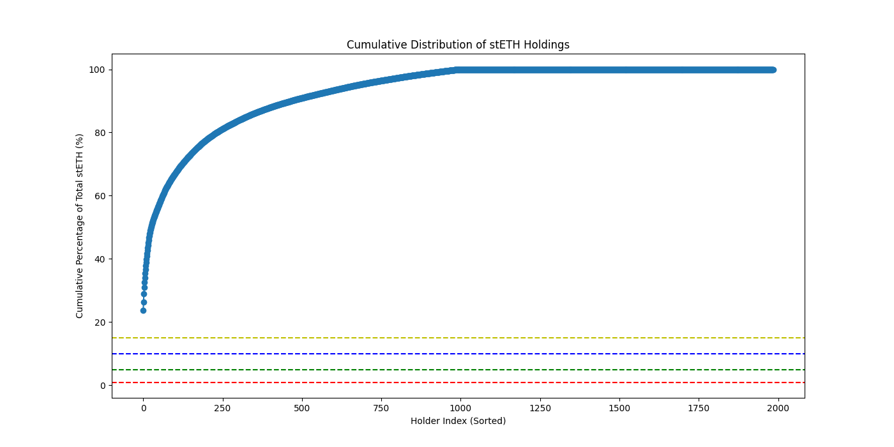
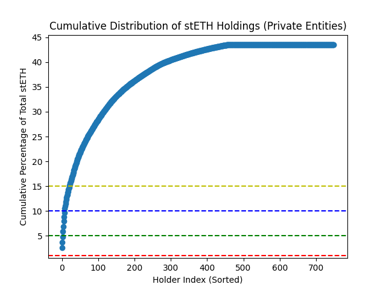

> Original research repository: [20squares/dual-governance-public](https://github.com/20squares/dual-governance-public)

# Table of contents
<!-- markdown-toc start - Don't edit this section. Run M-x markdown-toc-refresh-toc -->
- [Table of contents](#table-of-contents)
- [Summary](#summary)
    - [Objectives](#objectives)
    - [Analytical frameworks](#analytical-frameworks)
    - [Main results](#main-results)
        - [TL;DR](#tldr)
        - [Intended function of the mechanism](#intended-function-of-the-mechanism)
        - [New attack vectors](#new-attack-vectors)
        - [Costs of temporarily halting the protocol](#costs-of-temporarily-halting-the-protocol)
        - [Parameter choices and recommendations](#parameter-choices-and-recommendations)
        - [Limitations of analyses and further directions](#limitations-of-analyses-and-further-directions)
- [Explaining the game-theoretic model](#explaining-the-game-theoretic-model)
    - [State machine components](#state-machine-components)
    - [Models and model components](#models-and-model-components)
    - [Payoffs](#payoffs)
    - [Analysis](#analysis)
    - [Assumptions made](#assumptions-made)
    - [File structure](#file-structure)
- [Analyses](#analyses)
    - [Objective 1 of dual governance mechanism: protection of (w)stETH holders and arbitration vehicle](#objective-1-of-dual-governance-mechanism-protection-of-wsteth-holders-and-arbitration-vehicle)
        - [Summary](#summary-1)
        - [Details](#details)
    - [Objective 2 of dual governance mechanism: avoiding new vectors of attack introduced through the dual governance mechanism](#objective-2-of-dual-governance-mechanism-avoiding-new-vectors-of-attack-introduced-through-the-dual-governance-mechanism)
        - [On-chain dimensions](#on-chain-dimensions)
        - [Role of committees](#role-of-committees)
        - [Costs of halting the protocol](#costs-of-halting-the-protocol)
            - [Basic considerations](#basic-considerations)
            - [Single actor](#single-actor)
            - [Leader-follower](#leader-follower)
    - [Parameter choices and tradeoffs](#parameter-choices-and-tradeoffs)
        - [Improve the functioning of the protocol as a safety hatch](#improve-the-functioning-of-the-protocol-as-a-safety-hatch)
        - [Preventing the halting of the protocol](#preventing-the-halting-of-the-protocol)
        - [Concrete restrictions of parameters](#concrete-restrictions-of-parameters)
            - [Initiation parameters](#initiation-parameters)
            - [Entering into VetoSignalling and RageQuit](#entering-into-vetosignalling-and-ragequit)
            - [Out of rage quit](#out-of-rage-quit)
            - [Cycling through the state machine.](#cycling-through-the-state-machine)
            - [Committees](#committees)
            - [All parameters](#all-parameters)
- [Installation](#installation)
    - [Test execution](#test-execution)
    - [Interactive execution](#interactive-execution)
    - [Main execution](#main-execution)
    - [Addendum: Installing haskell](#addendum-installing-haskell)
        - [Installing through `nix` (recommended)](#installing-through-nix-recommended)
            - [Installing `nix`](#installing-nix)
            - [Setting up the environment](#setting-up-the-environment)
            - [Freeing space](#freeing-space)
        - [Installing through `GHCup`](#installing-through-ghcup)
- [Code deep dive](#code-deep-dive)
    - [Recap: DSL primer](#recap-dsl-primer)
        - [The building blocks](#the-building-blocks)
        - [Exogenous parameters](#exogenous-parameters)
        - [Basic operations](#basic-operations)
        - [Branching](#branching)
        - [Supplying strategies](#supplying-strategies)
            - [Evaluating strategies](#evaluating-strategies)
            - [Stochasticity](#stochasticity)
            - [Branching](#branching-1)
- [Analytics](#analytics)
    - [Reading the analytics](#reading-the-analytics)
    - [Running the analytics](#running-the-analytics)

<!-- markdown-toc end -->

# Summary

## Objectives

We provide an analysis of the proposed Dual Governance Mechanism by Lido. The main objective of this mechanism is to protect stETH holders in case the DAO intends to implement decisions which are actively harmful for stETH and wstETH holders. The protection is to be achieved in two ways: Provide a rage-quit mechanism for (w)stETH holders and enable to use the mechanism as a "a negotiation device". Our analysis has focused on two main questions:

1. Does the mechanism work and protect (w)stETH holders? In particular, can malicious proposals be introduced by the DAO and be executed or can they be stopped and if adequate be renegotiated? Under which conditions is a renegotiation feasible?
2. Does the mechanism introduce new vectors of attack on the main protocol? In particular, are there actions available that halt the main protocol indefinitely or delay the execution of non-malicious proposals? Can we estimate the costs associated with a possible attack?

Besides the general architecture of the proposed mechanism which is the main focus of our analyses, both objectives depend on the exact choice of parameters set by the protocol. In addition, deployed contracts have to pick specific parameters. We were also tasked to address which parameter ranges are reasonable.

## Analytical frameworks

We are employing different frameworks in order to provide answers to the above questions. Our main framework is game theoretic: We are using our own compositional game theory engine to analyze the incentives of the different actors involved in the dual governance on-chain mechanism.

One consequence of the game theoretic framework we use is that our analyses can be replicated, altered, and extended by anyone interested. In particular, in so far as changes to the dual governance mechanism or changes to parameters are proposed, its effect on our conclusions can be easily checked through running a battery of tests. We provide installation and usage hints in the sections below.

A crucial aspect in modelling (in general) is the question of where to draw the boundary and what to abstract away. This is important as the mechanism does not exist in a vacuum but is embedded in the wider Lido protocol, the Ethereum ecosystem, and financial markets. It is evidently impossible to include all in our analysis. Instead, we need to make decisions on what to cut out.

Most of our game theoretic analysis focuses on the mechanism proper. However, we add empirical analyses as well as approximations or back-of-the-envelope calculations for factors that influence the mechanism. This also includes some of the parameter choices as they cannot be pinned down by the game theoretic analysis alone and are also partly exogenous. One example includes the availability of (w)stETH. The mechanism relies on time duration in which execution is paused. It is crucial that some time windows allow sufficient stETH holders to react. But this requires that stETH is not locked in some contracts but readily available.

Throughout our analysis detailed knowledge of the mechanism and its [publicly available specification](https://github.com/lidofinance/dual-governance/blob/develop/docs/mechanism.md) is assumed.


## Main results

### TL;DR

**Intended function of the Mechanism**
- For evidently malicious proposals, the mechanism works mostly as intended.
- In the case of proposals whose consequences are less clear; its proper functioning is not certain.
- Dependence on the Ecosystem:
  - DAO: The mechanism's effectiveness relies on the working of the DAO; i.e. proposal introduction, evaluation, and information dissemination.
  - Liquidity & Congestion: During critical periods, high demand to lock tokens can lead to congestion and elevated costs, potentially weakening the mechanism when it is most needed.

**New Attack Vectors**
- No critical vulnerabilities were identified
- Increased Complexity: The mechanism’s added complexity introduces new risks, such as exploiting state oscillations (e.g., toggling veto-signaling) to delay or block decisions.
- Manipulation Risks: Attackers might leverage ambiguous proposal assessments or manipulate committee actions, which could lead to prolonged protocol halts or harmful proposals being pushed through.

**Parameter Recommendations**
- Parameters cannot be pinned down by the game theoretic model alone; hence auxiliary analyses to restrict parameter bounds
- Parameters should balance protecting (w)stETH holders against preventing harmful proposals and unnecessary delays.
- Suggested directional adjustments:
  - Lower the trigger threshold for veto-signaling.
  - Increase the minimum time-lock duration to give token holders more time to react.
  - Raise the rage quit threshold to make attacks more expensive and provide time for token holds to get into the contract.
- Overall Goal: Ensure the mechanism functions primarily as a last-resort safety measure rather than a negotiation tool, avoiding prolonged limbo states.

Our analyses result in the following proposed parameter ranges:

| Parameter                             | Default | Min  | Max  | Unit  | Adaptable? |
|:--------------------------------------|:--------|:-----|:-----|:------|:-----------|
| FirstSealRageQuitSupport    $R_1$     | 1       | 0.15 | 1.36 | %     | x          |
| SecondSealRageQuitSupport   $R_2$     | 10      | 10   | 30   | %     |            |
| ProposalExecutionMinTimelock          | 3       | 2    | 7    | days  | x          |
| DynamicTimelockMinDuration $L_min$    | 5       | 3    | 7    | days  |            |
| DynamicTimelockMaxDuration $L_max$    | 45      | 30   | 75   | days  |            |
| SignallingEscrowMinLockTime           | 5       | 4    | 6    | hrs   | x          |
| VetoSignallingMinActiveDuration       | 5       | 3    | 9    | hrs   | x          |
| VetoSignallingDeactivationMaxDuration | 3       | 1    | 3    | days  |            |
| VetoCooldownDuration                  | 5       | 4    | 12   | hrs   | x          |
| RageQuitExtensionPeriodDuration       | 7       | 7    | 14   | days  |            |
| RageQuitEthWithdrawalsMinDelay        | 60      | 45   | 90   | days  |            |
| RageQuitEthWithdrawalsMaxDelay        | 180     | 150  | 240  | days  |            |
| RageQuitEthWithdrawalsDelayGrowth     | 15      | 15   | 45   | days  |            |
| TiebreakerExecutionTimelock           | 1       | -    | -    | month |            |
| TieBreakerActivationTimeout           | 1       | -    | -    | year  |            |


`Default` refers to values proposed in the initial spec. `Adaptable?` parameters are ones which should be monitored in practice - they are possibly used even though it does not come to a rage quit event. E.g. if `FirstSealRageQuitSupport` is chosen too small and a repeated invoking and thereby halting of the protocol is observed, the parameter can be adapted upwards.

### Intended function of the mechanism ###

The dual governance mechanism incentivizes agents to act based on the tradeoff between opportunity costs (e.g. forgone earnings) of sending tokens to the escrow and expected rewards, shaped by their expectations of the game’s evolution.

Effective use depends on perceptions of proposal detriment, beliefs about others’ reactions, and confidence in the mechanism’s reliability. However, coordination challenges, such as free-rider problems and private information can hinder its effectiveness.

While it functions well against universally recognized detrimental proposals, achieving its negotiation-facilitation goal can be difficult for agents due to these challenges. It is important to recognize that the dual governance mechanism does not exist in a vacuum.

On the one hand its performance is contingent on the proper functioning of the DAO. Proposal introduction, proposal evaluation, and information dissemination are key for the dual governance mechanism to operate effectively. On the other hand, while the mechanism itself might function as intended in the case of an issue, to use this mechanism token holder need to transfer their tokens into the contract. These transfers are contingent on the proper working of the wider eco-system. If many agents aim to get their tokens into to the contract at the same, this might only be achieved at significant costs. There is therefore a danger that the effectiveness of the mechanism is weakened exactly then when the mechanism is needed most.

### New attack vectors ###

We did not identify critical vulnerabilities due to the introduction of the dual governance mechanism. We note again that we did not conduct a code-level review of the implementation. And, while obvious, still worth emphasizing, the fact that we did not identify a vulnerability does not mean there are no critical vulnerabilities.

The introduction of the dual governance mechanism does increase the action surface of what agents can do. This in turn does open avenues for influencing the performance of the protocol. What are the most critical areas?

The possibility to oscillate between different states, in particular around veto-signalling, is one design element which introduces complexity and thereby possible vulnerabilities. The complexity arises on the implementation side, as possible vulnerabilities on the code level can more easily proliferate on the actual working of the mechanism. But it also introduces complexity on the socio-economic level as it makes the behavior of the mechanism contingent on complex interactions and thereby harder to predict for individual agents.

In general, compared to the state of the protocol without the dual governance mechanism, its introduction opens up various ways in which the operations of the DAO can be temporarily halted and thereby prolonged. Malicious actors may exploit state oscillations or ambiguity in proposal assessments to slow or block the process. LDO holders could also manipulate DAO votes to reduce timelines, exploiting complexity to push harmful proposals. Such tactics may lead to protocol halts, lenient proposal adoption, and misuse of the DG mechanism, particularly in contested scenarios where veto actions halt all proposals indiscriminately.

The proposed introduction of new committees to provide a solution for a possible deadlock introduces significant risks, particularly the possibility of an indefinite protocol halt. It also opens up possible attack routes through side-payments and bribes to members. Currently, it is hard to make a more systematic assessment of the committees as its size, voting thresholds, exact member selection, and voting rules are only partially known. These should be made publicly available so that people can assess the credibility of these committees. Evidently, and similar to the composition of existing committees, the selection of suited committee members with reputation in the ecosystem and being aligned with Lido and/or having assets at risk is one way of mitigating the risk of corruptible persons.

### Costs of temporarily halting the protocol ###

We also did some very approximate calculations regarding the costs of halting the protocol. Note that we ignore possible motives - there might be ways how to halt the protocol and profit at the same time. Due to the complexity of the DeFi landscape that is beyond the scope of this report. We do make (rough) proposals how an assessment could be refined.

The cost of halting the protocol primarily revolves around gathering sufficient liquidity in form of (w)stETH tokens to trigger time-locks, with the current requirement ($R_2$) being 10% of token value, roughly valued at $3 billion at the time of writing. This liquidity would be bound for at least 105 days, encompassing the time-lock duration (45 days) and withdrawal halt period, with opportunity costs estimated at ~$35.5 million assuming e.g. a 4% p.a. returns.

One key property of the dual governance mechanism is that there are no direct economic costs for misusing the protocol. If an entity (or a set of entities jointly) trigger a rage quit, the tokens sent to the escrow retain value, accrue consensus validation fees, and can ultimately be converted to ETH. In other words, there is no direct slashing.

Attacks could become cheaper through dynamic strategies, such as gradually triggering the time-lock and leveraging leader-follower effects, where herd behavior reduces the attacker’s required capital. These dynamics are highly unpredictable and could generate unstable second-order effects, potentially encouraging further participation by other agents.

Additionally, sell pressure on (w)stETH from escrow-related activities might lower market prices, reducing the cost of acquiring tokens. However, safeguards like the RageQuitExtensionPeriodDuration parameter limit the possibility of repeated rage-quits using the same capital.

Overall, while the liquidity requirements are substantial, opportunity costs remain the primary factor, and social dynamics or market reactions could significantly alter the cost and feasibility of such attacks.

Let us end this section with a remark how the above could be extended. In principle, it should be possible to derive some bounds on both costs and possible payoffs of an attack. On the costs side this would require estimating the liquidity costs for different potential existing liquidity positions as well as different possible target needs (assuming other inflows into the escrow). It should also be done over different time horizons as building up a position short term would be evidently more costly. On the payoff side, for instance, one angle would be to consider the possibility of shorting LDO or mis-pricing as a result of token holders getting their (w)stETH out of liquidity pools. Under certain circumstances this might be a viable upper bound for the value of an attack. Both, costs and benefits, could be estimated with sufficient investment in data and suitable analyses. This would enable a rough comparison between costs and benefits and help to gauge how lucrative an attack might be under given conditions. Related to understanding the costs of building up a suitable position which would enable an attack, is that this could also be flipped into a monitoring system. The build up of critical positions or shifts in the distribution of (w)stETH positions could be used for early warnings or trigger points for closer monitoring.

### Parameter choices and recommendations ###

When the Dual Governance Mechanism gets deployed as a smart contract, concrete choices for parameters are required. In the following we discuss reasonable choices of parameters.

The first thing to note is that while parameters affect the equilibrium behavior of the game (and we do have investigated parameter ranges which support the equilibria), the game theoretic analyses alone are not sufficient to sufficiently pin down parameters.

The reason is simple: The game theoretic models make assumptions regarding the outside environment. For instance, the time period during which an introduced proposal can be halted is not very relevant for this analysis. However, as pointed out above, the social dynamics that affect whether and how long it takes for (w)stETH holders to make use of the mechanism are clearly important for the mechanism _and_ are affected by parameter choices. The same applies to the costs of an attack which are, as discussed in the section before, affected by the parameters.
There are too many non-quantifiable moving parts (e.g. the DAO processes; behavior of committees). Trying to pin-point specific point values would be dubious and not justified given the analyses we did.

Instead we first provide directional recommendations, that is whether parameters should be rather increased or decreased given the current values chosen. We also employ additional back of the envelope calculations how to further restrict the interval of plausible choices. It goes without saying that such analyses are rough approximations and should be refined in the future. We provide several pointers.

We begin with some directional recommendations, that is, whether parameters should be rather increased or decreased given the current values chosen.

The introduction of the dual governance mechanism poses a general tradeoff between two objectives: protecting (w)stETH holders and protecting the core protocol from damages and unnecessary delays. Several of the key parameters are obviously exposed to this tradeoff. Before picking on specific parameters, we want to emphasize a high-level perspective. In our analysis, the mechanism performs as intended in case of an obviously malicious proposal so that a fraction of (w)stETH holders want to leave the system. Most problems arise when proposals are ambiguous - this is also where one provides easier surface for intentionally halting or delaying decisions.

Thus, from our perspective, the overall goal should be to emphasize the role of the mechanism as an actual safety hatch and demote its role as a way to facilitate arbitration between (w)stETH holders and LDO holders. This means that if the mechanism gets called it should visit states only once as far as possible. Say, a proposal is critical and the veto-signalling state is triggered. Then, it is preferable if the mechanism either extends to rage-quit with stakers leaving or returns to normal - after all an initial assessment of a proposal might be wrong or a bad proposal gets withdrawn. In our view the mechanism works best if it serves as a credible threat that disciplines the DAO decision-making and prevents the introduction of bad proposals in the first place. But for this to work, the mechanism cannot be used as an extension of the DAO.

What does this imply for parameters values? Longer timelock thresholds give (w)stETH holders more time to act but increase costs to the protocol, while shorter thresholds reduce delays but may expose stakers to risk. Analyses of token distributions shows that although a few entities can trigger veto-signaling or rage quit, most tokens are locked in contracts, limiting immediate availability. This suggests that the initial phases of a proposal should allow leniency for evaluations, but once attention is high, decisions should occur as quickly as deemed feasible for token holders to get into the contract. The question of how quickly (and at which costs) token holders can get into the contract is plagued by uncertainty: Depending on the amount of inflow congestion and high costs may result. This is one of the areas which warrants further analysis.

This means: lowering the trigger threshold for veto-signaling, increasing the minimum time-lock duration, raising the rage quit threshold, and (possibly) shortening the maximum time-lock. These changes aim to facilitate rapid attention to critical proposals while minimizing extended limbo periods.

To prevent halting attacks, it is again important to realize that there are no direct costs of an attack as tokens in the escrow get transferred back into ETH. As the maximal timelock does only marginally increase an attacker's costs but possibly increases the attractiveness of halting the protocol significantly, shorter maximal timelocks seem preferable.

One way of raising the costs of an attack could be through raising the rage quit threshold. The cost of acquiring sufficient tokens likely grow non-linearly with the threshold as it becomes more and more expensive to acquire extra tokens. Note, that the costs do not rise for (w)stETH holders acting in good faith  as they already hold the necessary liquidity. Lastly, lengthening the withdrawal timelock further reduces the appeal of (repeated) attacks. At the same time this exposes holders more the ETH macro risks as they cannot leave the eco-system.

### Limitations of analyses and further directions ###

As remarked above, while we consider interactions of the dual governance mechanism with the outside world, given limited time, we have to make cuts and ignore possibly important aspects.

We want to draw attention to three aspects here:

1. The decision-making process in the DAO. In particular, how information processing works, how information spreads in which speed through the network, and in which sense there might be information cascades due to herd/ follow-the-leader behavior. As our analysis shows, the way the DAO operates is of key importance for the proper functioning of the dual governance mechanism.

2. Sophisticated financial attacks on LIDO. Our analyses are mostly focused on the internal workings of the dual governance mechanism. While have considered attacks and its associated costs on the protocol, we ignore the motives behind an attack. In particular, possible attacks on the protocol in order to gain from financial exploits is outside the scope of our (current) analyses.

3. The proper working of the mechanism is contingent on the ability of actors to transfer their tokens into the mechanism. This itself is contingent on the wider-ecosystem. Analyses and stress tests which evaluate the inflow under distress could help to demonstrate the reliability of the mechanism.

Note that all three aspects and also the mechanisms itself are moving targets. We provide a snapshot analysis that should be extended and kept up to date over time.

Lastly, it is important to understand that the conclusions derived here are based on an extensive but ultimately finite number of scenarios we consider. Similar to testing of software, the absence of problems is no proof of absence of issues in the design. In addition, the models we generated are relying on a non-trivial codebase we have built up in the course of this project. Like any other codebase, we cannot exclude the possibility of errors. It is also important to emphasize again that our model (intentionally) is based on the specification not the actual implementation.

# Explaining the game-theoretic model

The code contained in this repo builds a game theoretic model of the dual governance mechanism based on this [spec](https://github.com/lidofinance/dual-governance/blob/develop/docs/mechanism.md). Note that the code contains detailed explanations of how specific parts of the model work. Here, we provide a high-level overview of the codebase.

Also note that our model follows the spec and is not based on the actual implementation. This is intentional as our focus is on the proper functioning of the model as _intended by design_.

The model includes the main actors involved in on-chain actions, that is, the DAO and LDO holders as well as (w)stETH holders.

As explained above, we also do some analyses outside of the core game theory model, in particular where off-chain components and interactions are concerned.

## State machine components

The dual governance mechanism in essence implements a state-machine. In order to probe the strategic aspects of that mechanism, we need to mirror this implementation. The state machine is implemented in `SupportFunctions.hs`.

## Models and model components

The models we use for analyses represent a sequence of interactions between the DAO and the dual governance module. These scenarios are split up into main components contained in `Components.hs`. The main components involve ways in which the DAO votes and executes actions as well as how stakers react to it in the context of the dual governance mechanism.

We consider a whole range of scenarios from a game theory perspective. We have distilled most of the scenarios as far as possible so that they are easy to access. They are contained in `Model.hs`.

As a result, we have many scenarios which collapse the heterogeneity of agents. E.g. in our setting, the difference between wstETH and stETH is minimal and is therefore ignored for most purposes. Note however, that this is an argument at the economic level. Differences in the smart contract implementations might obviously influence the validness and functioning of the mechanism.

## Payoffs

In order to model the behavior of different agents as a game, we need to supply payoff functions. As our focus for "honest" agents is mostly on scenarios where the DAO could harm the (w)stETH holders, we mostly focus on scenarios where current assets are at risk. That is, "Alice" might have a position in stETH and fear for a loss of value of her assets if the DAO implements proposal "XYZ".

We therefore model Alice's payoffs as a possible loss of her assets. Note that we split the payoff into three components: First, we assume there is an objective value of a proposal characterized by the probability of reducing the value of existing (w)stETH. Second, we assume that individual players might have subjective, and only privately known beliefs about specific proposals. In this way, we can include heterogeneity of beliefs about the impact of a specific policy. Third, we also consider the case where individual agents receive private, informative signals about proposals' effect. As with many things related to modelling such scenarios, this is a choice we make. Alternatives are possible and might make sense. Note that a change of this implementation is easily doable and requires just a change in one function (`computeAssetsAtRisk` in `SupportFunctions.hs`)

## Analysis

The focus of our analyses for the game theoretic model is on checking whether strategies by the players are in equilibrium. That is, for each state of the game, the different players do not have an incentive to deviate from their strategies.

Most of the time we intentionally ignore a large surface of possible interactions between DAO and dual governance mechanism. In particular, scenarios in which non-malicious proposals are proposed and executed receive little attention from our side as they are evidently not critical for the performance of the mechanism.

Our focus is mostly on proposals which are malicious and possible harmful for (w)stETH holders.

The way we practically test this is through Haskell's testing environment. We postulate equilibria that should hold for a range of parameters and then have the test suite verify these properties.

One clear benefit from this setup is that one can vary the mechanism and then observe the test behavior afterwards. All tests regarding the equilibria can be found in `GameSpec.hs` under `tests`. Note that this file contains detailed explanations of the concrete scenarios tested.

These tests rely on strategies by the different actors involved. Typical tests described in the test file provide information on the strategies employed. Further information can be found in `Strategies.hs` where the strategies are defined.

## Assumptions made

Time obviously plays a crucial aspect in the functioning and performance of the mechanism. Note that from a game theory perspective, we often focus on the "end-point" of time intervals. The main idea is that most of the strategically relevant aspects of the mechanism are about the point of when state transitions happen. For that reason, significant parts of our analyses use a fast-forward mode: If a state transition happens, and the agents do not affect a change in the state and a further transition instead relies on time progressing, we fast forward to the point where the mechanism can progress. While this seems harmless, from a game theoretic perspective it is important to understand that it makes assumptions that all agents are waiting in the same way.

Another aspect worth mentioning is the question of continuation. The dual governance mechanism in principle models a very rich negotiation environment. It is impossible to model all the contingencies or the full unfolding of these negotiations in a game. It is also questionable from a modelling perspective as agents might simply not reason about such a complicated game. For that reason, we zoom in on a few typical interactions between DAO and dual governance mechanism. Yet such an approach requires making an assumption about the future evolution of the game. Is a proposal eventually abandoned or accepted? We are using a feature of our engine which allows to feed in arbitrary future continuations. It is important to understand that this requires common knowledge of the players. As we argue below in our main analysis, we do believe this is without harm.

## File structure

Our analysis is composed of several files:

- The `test` folder contains some basic Haskell testing code. Here 'test' refers to two kinds of test. One, in the traditional development sense, that is, tests to check that the code works properly. Second, tests that refer to game analytics. These tests check behavior of the model for a range of parameters.  When one uses `stack test`, the equilibrium checking of different scenarios is executed. We suggest to start from here to get a feel of how the model analysis works (cf. [Running the analytics](#running-the-analytics)).

The code proper is contained in the `src` folder:
- `ActionSpace.hs` is mainly needed for technical type-transformations. It maps a player's decision type into the type needed to be fed in the subsequent game.
- `Analytics.hs` defines the equilibrium notion for each game we want to test.
- `Components.hs` is where the subgames making up the whole model are defined.
- `Model.hs` is the file where the subgames are assembled and the main model is defined.
- `Parametrization.hs` defines the concrete parametrizations used for the analysis. This comprises all the parameters defining the initial state of the model, as for instance may be players' initial endowments, weights in a payoff matrix, fixed costs to perform some operations, etc.
- `Payoffs.hs` is where the payoff functions used in every (sub)game are defined. We decided to keep them all in the same file to make tweaking and fine-tuning less dispersive.
- `Strategies.hs` is where the strategies we want to test are defined.
- `SupportFunctions.hs` is where we defined some plain-Haskell functions that are going to be used in the model. Here, for instance, the main logic of the dual governance state machine is implemented.
- `Types.hs` is where we define the types for the main ingredients of the model. As it can grow very complex, enforcing some type discipline either by means of simple type-aliasing or by defining new types helps to contain sources of errors.

Relying on the DSL Primer, parsing the code structure should be a manageable task.

All the code lives in a unique branch, named `main`.

# Analyses


## Objective 1 of dual governance mechanism: protection of (w)stETH holders and arbitration vehicle

### Summary

For proposal that are recognized as malicious and would result in losses on the side of (w)stETH holders, the mechanism in our analysis works as expected. When assets are at risk, (w)stETH holders have an incentive to use the mechanism to protect their assets.

When proposals are not immediately recognized as malicious, the effectivity of the mechanism is less clear. As (w)stETH holders have costs when sending their tokens to the dual governance escrow, it becomes a more complex choice and is now also inter-dependent with other (w)stETH holders.

This questions also how effective the mechanism can be at arbitration between DAO and (w)stETH holders. Lastly, it emphasizes the importance of the proper functioning of the DAO when it comes to evaluating proposals.

The more effective this process the more effective can the dual governance mechanism work.

### Details

A key question is whether malicious proposals can be stopped. The proper functioning of the proposal is tested in the tests contained in `GamesSpec.hs` which contains a series of equilibrium tests of the different models contained in `Model.hs`.

These tests verify that the staking component in isolation work as intended. `prop_StakingGameEq2`, for instance, verifies that if a malicious proposal is proposed and it cannot be prevented, then individual stakers should send their tokens to the escrow to preserve their value. More generally, tests under section `1`  verify elements of the isolated staking actions. Test under section `2` and `3` verify the basic logic of the interaction between a staker and the DAO.

Ignoring heterogeneity, things are more subtle when it comes to proposals that should be stopped through the veto-signalling process.  As soon as there are costs, the optimal amount is not necessarily the full wealth transfer but less. It is also note-worthy that the usage of the dual governance mechanism depends on the expectation of how the interactions with DAO and dual governance module continue. That is, the use of veto-signalling only makes individual sense in so far as the expectation is that the current (negative) proposal is not executed (see `7` for a test of alternatives). If such beliefs do not hold, then there will be no staking in the first place. The reason for the latter is simply that staking then only has costs but no benefit.

The situation is more subtle when it comes to proposals that are not immediately recognized as malicious and/ or when subjective assessments among (w)stETH holders differs (cf. `8` to `10`). In that case, the game theoretic nature of the game becomes complex. The main reason for the complexity arises due to the fact that putting (w)stETH into the dual governance escrow has costs. Costs include forgone return opportunities but might of cause also include a risk premium regarding the overall functioning of the mechanism itself. Once costs are present, putting tokens into the escrow has tradeoffs. In addition, there is a collective action problem. A given stETH holder would prefer another stETH holder to pause the execution of the DAO. Halting the proposal is like a public good for (w)stETH holders: everyone benefits but not everyone pays.

Thus, in the case of non-obviously malicious proposals with heterogenous stakers and different beliefs is that there is a possible complex coordination problem that is hard to predict.

This coordination problem also points to another dimension: The dual governance mechanism does not live in isolation. Instead, it is crucially dependent on the information flow coming from the DAO. Assessements of proposals, heterogeneity of subjective beliefs are all ultimately affected by the process within the DAO. The more effective this process is at evaluating proposals and spreading information through the network the less of an issue should the collective action problem becomes.

To summarize, while for obvious malicious proposals the mechanism provides a safety hatch, the idea of using the dual goverance mechanism for arbitration becomes very subtle and uncertain.

One counter-argument to this could be that in a repeated usage of the mechanism norms, shared information etc. will facilitate a more coordinated usage of the mechanism. While this might be true in theory, it is far from obvious how this process would work in practice though - specifically with the evolution of Lido over time. Even more important is the question of whether the mechanism will be used repeatedly at all. The mechanism really is a safety hatch. It is not necessarily meant to be used on a regular basis - in that case it would be an indicator for structural problems with the decision-making process more broadly.

In fact, one interpretation of the mechanism is that it really is a mechanism that should only be used in extreme circumstances. Maybe it is even a component that works mostly through its presence but will not be used, like a "nuclear deterrent". Under such a scenario it becomes evident that the interactions in the mechanism are much more of a one-shot nature. And therefore, the coordination issue pointed to before are actually important.

According to our assessment the nature of the mechanism as a safety-hatch and not as an arbitration mechanism should be emphasized and should be the focus of the design. While there must be ways to revert an initial flight into the escrow, the mechanism should not be generally be designed as a vehicle for arbitration of proposals.


## Objective 2 of dual governance mechanism: avoiding new vectors of attack introduced through the dual governance mechanism

### On-chain dimensions

We begin with an analyses of the dual-governance components proper, i.e. those which will be interacted with on-chain.

One of the weakest links is the staking into and the unstaking from the escrow - essentially enabling to keep the contract in the Veto-Signalling state for a limited amount of time. This part of the mechanism also seems like an obvious angle for code-level vulnerabilities around this which could magnify.

What new levers does the system open for potential attackers, and what are the conditions/requirements to trigger those? Again, we focus first on LDO holders and stETH holders.
As noted before, LDO holders aiming to cause damage for stETH holders might be able to exploit the middle ground of proposals that are not immediately recognized as such. The functioning of the proposal process for uncovering malicious proposals and preventing their quick implementation is key. An obvious step would also be to have the DAO vote on changing the DG parameters before-hand (reduce timelines) and then have another vote following up with the malicious proposal.

It is clear that through the staking/unstaking mechanism, an actor might not be able to halt the system indefinitely (given L_max) but it might be used to slow the system down by entering into and out of Veto-Signalling. The 5 hrs window for VetoSignallingMinActiveDuration seems quite short. In practice this means that, theoretically, out of three days (current value for VetoSignallingDeactivationMaxDuration) a sophisticated actor could keep the DG ~67hrs in VetoSignallingDeactivationSubState and thereby prevent submission and execution of new proposals. This could block the system significantly. In practice, this exact ratio is not possible due to transfer limitations. Qualitatively, the possibility to halt the system is given though.

Moreover, this could also be the prelude of an attack. Block the system, create a backlog of proposals and speculate on relatively lenient adoption after the halting is over. This again depends on the practice of how proposals are adopted.

In general, the fact that one can go back and forth between the same states in our assessment offers the most obvious attack surface. As a consequence, anything that makes the use of the dual governance mechanism more one-directional, i.e. states should only be entered once and not repeatedly - as for instance in the case of a real emergency, makes the mechanism more robust and reduces potential vulnerabilities. The distribution of tokens that we analyzed also makes clear that there are several entities which can easily trigger this single-handedly (13 for the current threshold).

Another concern is that the DG mechanism could be weaponized for contested DAO proposals among LDO holders. Note that triggering Veto-Signalling is not specific to particular proposals but halts all proposals in a certain stage, so for example an actor could use the threat to halt all proposals as leverage to pass one. Obviously, the lower the threshold, the higher the risk that one player ends up using it.

### Role of committees

The dual governance mechanism and its associated state machine are concerned with the protection of the (w)stETH holders. Given its ability to pause decision-making, depending on its state, it also affects the ability of the protocol to error correct recognized issues in the main protocol.

Given the possibility of time-sensitive counter-measures being called for, the protocol has the Gate Seal, an emergency feature to halt the protocol for a fixed period of time. The idea behind this is that the pause enables the DAO to correct errors/bugs in contracts.

With the introduction of the dual governance mechanism, there could be an unfortunate (or intentionally brought about) situation where the dual governance mechanism is not in Normal, decision-making by the DAO is essentially blocked.

As a counter-measure the dual governance mechanism introduces an additional committee that can essentially extend an indefinite pause (Reseal committee). Lastly, given the ability to stop the protocol, another committee has to be introduced in order to overwrite the state in the case of a specific event:
With an indefinite pause, there is the acute danger of a deadlock, with an indefinite pause and protocol withdrawals paused as well, and the dual governance mechanism being either before the Rage Quit stage or in a non-completed Rage Quit stage, the DAO cannot execute remedies.

Given the infinite interaction space between individual committee members and their interaction with the protocol, it is not clear how to model this feature. An inclusion in our game-theoretic setup, while feasible in principle, suffers from the relative arbitrariness of assumptions we would have to impose.

This is also due to the fact that the current specification is relatively opaque and does not provide many details on the committees sizes, voting thresholds, voting rules etc. This should be clarified - not only for modelling purposes but for everyone following the mechanism.

Given the uncertainty around the exact specification and the general methodological difficulties, we therefore abstained from building out formal models but instead provide a broad, qualitative assessment.

First and in general, the combination of the dual governance mechanism and general safety hatches for error correction in the protocol opens up a critical surface - at the code level as well as from an economic/incentive perspective. And the biggest vulnerability is the possibility of an indefinite pause.

Second, we are not totally convinced that a maximum time-break could not be included and would recommend exploring this route at least further. While it makes sense to be careful with changing the gate-seal contracts and in particular extending their reach, it would be preferable to limit the power of the reseal committee. It seems to us that a maximum time break, even if chosen for a relatively long period, would strengthen the protocol significantly. This would provide a way out of a possible deadlock.

Third, the introduction of a committee opens up obvious ways to damage the protocol through bribes. Again, how realistic this is, or how much resources it would take, is very hard to gauge without much more detail on the exact voting procedure, composition of the committee etc.


### Costs of halting the protocol

#### Basic considerations

A central question is how costly would it be to halt the protocol. In this section, we ignore possible code-level vulnerabilities, side-payment attack, and similar exploits but instead focus on the built in ways to pause the system. Now, given the wide array of possible ways of funding an attack on the system, there is lots of uncertainty. It is very hard to pin such an attack down to a specific model.

What we will do instead is to characterize such attacks and we do some back-of-the-envelope calculations for how costly halting the protocol will be.

To begin with, note that we are not concerned with the motives of an attacker. There might be ways how a rational attacker might profit from halting the protocol, the most obvious one by causing some short-term mis-pricing and then realizing arbitrage in the aftermath. Evidently, given the complexity of DeFi there might be various ways to go about this. This is outside the scope of our work and would warrant its own analysis.

Instead, let us consider what are possible ways to halt the protocol and how much resources would be needed to execute it.

#### Single actor

As a starting point for our an analysis we consider a single actor. The linchpin for a (limited) halting attack are the time-locks. The maximal time-lock one can achieve under current parameters are 45 days. This requires a minimum of 10% of existing (w)stETH tokens.

So, the most obvious strategy is to gather enough tokens to achieve this halting condition. This obviously requires a lot of liquidity - at the time of writing, one would need to accrue roughly 3bn USD in stETH and wstETH in order to single-handedly trigger a rage quit. Acquiring such liquidity in turn might require significant costs. These costs itself depend on various factors like initial position(s), market conditions (e.g. slippage), time needed to build up a position etc. It is very hard to put a reasonable number on this.

In contrast to the amount of liquidity needed, the economic costs of halting the protocol are comparatively small. The reason for this is that the tokens employed in halting the protocol do not lose value per se. In the case of a rage-quit they will be converted to ETH after the timelock ends and the withdrawal halt has ended. With current parameterization this amounts at least to 60 days. So, tokens would be bound at least for 105 days in total. In principle, the timelock could be triggered gradually thereby reducing the amount needed right at the beginning but let us calculate with the upper bound (we come to an aspect of how to reduce the costs of attacks below).

As a consequence, the costs of getting the protocol to a pause, assuming sufficient liquidity, are mainly the opportunity costs of not having access to the tokens. Also note that when tokens are in the escrow but not yet converted to ETH, they still accrue consensus validation fees. For instance, assuming opportunity costs of 4% p.a., under current conditions this would amount to ~ 35,500,000 USD.


#### Leader-follower

So far we have assumed that a single actor or a coordinated group of actors will stop the protocol. But it is conceivable that other agents will react to an evolving dynamic - even if not driven by the objective to halt the protocol. We consider two scenarios.

First, one can also easily imagine a scenario where an attacker employs his (or proxies') reputation through social media to generate a leader-follower phenomenon. That is, an attacker generates herd effects whereby he can reduce the own capital (and costs) to generate a pause. There is obvious uncertainty how much costs for an attack can be reduced; this is almost impossible to predict.

Yet, we do have generated a model which illustrates that this mechanism can be supported by a formal model. (cf. section 7 in `GameSpec`, in particular `prop_Model8GameNegativeForStakersEq2` where an ignorant follower follows the lead of first moving player. And in this case chips in the relevant stakes to trigger a state change). It is also noteworthy that this effect could have further second order dynamics. When sufficient agents follow a leader's action that itself might cause other agents to chime in. Such dynamics are obviously unstable.

A second aspect to consider is are possible sell reactions to a large inflow into the escrow. That is, agents who hold (w)stETH might try to sell/swap their tokens in the market. If this were the case, then this would lower an attacker's costs of acquiring the relevant liquidity. Again, it is very hard to make any concrete predictions how such a scenario would pan out.

To end this part, we also note again that the dual governance mechanism has a timelock for withdrawals of unstaked ETH from the escrow after the conclusion of a rage quit (`RageQuitExtensionPeriodDuration` parameters). This is important as it reduces the possibility of a direct round-trip and restarting a rage-quit with the same capital. 

## Parameter choices and tradeoffs

The introduction of the dual governance mechanism poses a tradeoff between two objectives: protecting (w)stETH holders and protecting the core protocol from damages and unnecessary delays. Several of the key parameters are obviously exposed to this tradeoff. In this section, we summarize the main tradeoffs based on the preceding analysis.

In particular, time thresholds which stop or halt the execution of the protocol should be chosen with longer time horizons to protect (w)stETH holders and should be chosen with shorter time horizons to reduce the costs to the core protocol. Evidently, there is no optimal solution - only tradeoffs. In the following, we will emphasize the key parameters, the key tradeoffs as we identified them, and in which direction parameters should be possibly changed.

### Improve the functioning of the protocol as a safety hatch

From the analyses we have done it is clear that a key dimension is the functioning of the DAO's decision process and how information spreads through the network. Secondly, we already remarked that the idea of the DAO and dual governance mechanism being in (repeated) negotiations is harder to substantiate in concrete game-theoretic models and might cause problems.

When it comes to the robustness of the mechanism, these observations have consequences for the time-locks. We explore this here.

First, we need to make some assumptions regarding how the information processing and evaluation process for a given proposal works. What follows are plausibility considerations and not an in-depth analysis as this would go beyond the scope of our report.

We assume, that a given new proposal is looked at and possibly analyzed by a few actors initially - if at all. Casual inspection of the Lido discussion forum suggests this as well. As a consequence, we assume that the evaluation process is slow at the beginning. Limited resources are devoted to exploring any given proposal initially.

For that reason, it might take time for DAO members and then also (w)stETH holders to realize the full consequences of a proposal. Or in the worst of all worlds it stays undetected and can be executed.

In that context it is also important to realize that the dual governance mechanisms plays a crucial role in creating attention through the inflow and the possible activation of a state change.

Yet, for this mechanism to actually work, it is key to understand how easy such an inflow actually is. For that purpose, we have done some simple empirical analyses based on the current token distribution (data provided by the Lido team and dated February 2025).

The following two graphics show the distribution of stETH (wstETH) ordered by holding size. Included in the figure (horizontal lines) are several key thresholds.




These figures suggest that a significant number of entities can activate parts of the dual governance mechanism single-handedly (at the time of writing 3 can single-handedly cause a rage quit; 12 entities can cause the mechanism to switch to veto-signalling).

However, considering the total amount of tokens provides us only with a partial picture. A large chunk of tokens are stored in contracts or locked up. Which means they might not be easily transferred into the escrow - or at least this might take time and might also be associated with costs.

The following two graphs show the distribution of tokens that can be identified as being owned by private wallets. This is a proxy for being short-term available. The percentage are still relative to the total supply. The reason for this is simply that the dual governance mechanism's key thresholds are conditional on the overall supply.




As one can see the picture looks significantly different. As around 43% of stETH and 17% of wstETH are held by private wallets, on a short term notice only a significantly lower share of tokens can be moved in the escrow to activate the dual governance mechanism.

Now, let us further assume a proposal has been flagged as critical by some agents. We posit that once a certain attention level is crossed, the overall evaluation mechanism, i.e. different agents looking and assessing a given proposal is quite fast.

What does this imply for the dual governance mechanism? From our perspective this suggests that the initial phases until which a given proposal can be executed should rather be lenient and given thresholds possibly extended until an execution can happen. But after the veto-signalling stage is reached, under the assumption that with sufficient attention an assessment is reached rather fast, it should be clear that the proposal is either withdrawn and the problem thereby mitigated or it persists. In the latter case, (w)stETH holders will want to use the safety hatch.

It is clear that one needs a way to correct a false first assessment of a proposal wrongly assumed to be malicious. This is why there should be a way for (w)stETH holders to get out of the escrow. But as discussed before, once the sufficient level of attention is achieved, there is not necessarily the need to keep the protocol in a limbo for too long. In turn, this suggests to possibly shortening the maximum time lock. A counteracting force is the time that is needed for token holders whose tokens are not available short term to get into the contract. In addition, when many agents aim to get out of existing contracts there will be possibly congestion and time delays. As remarked before the big uncertainty concerns what happens in the case of a massive outflow at once. This warrants further analysis.

In sum, to us this suggests a directionally lower trigger threshold for the veto-signalling to start ($R_1$); a higher minimum time-lock ($L_1$); a higher threshold for rage quit ($R_2$); and lastly a lower maximum time-lock ($L_{max}$) subject to token holders having enough time to unlock their tokens from contracts and get into the Dual Governance Mechanism escrow.

Again, the logic being, give time and make it easy to create a pause. But then force a decision.

### Preventing the halting of the protocol

First, it is important to recognize that the cost of an attack _given available capital_ is not much affected by changing the time-lock condition. Increasing the time-lock would only mildly increase costs. Yet, it is conceivable that lengthening the time-lock would increase the possible profitability of an attack (the assumption being that once the protocol is on hold over a specific time period $t$, the potential gains from an attack increase dramatically).

The timelock for withdrawals is an important element in reducing the attractiveness of attacks and also to prevent round-tour attacks. It should be extended as long as other constraints allow.

The big unknown are the costs of building up a position. It is evident that the larger the rage quit parameter requirements, the larger the costs of acquiring the position. But not only that. It is plausible that these costs increase non-linearly. That is, the higher the threshold, the higher the relative costs needed to halt the protocol.

It is therefore worthwhile to consider higher thresholds. Note that a higher threshold for rage quit would not necessarily impose costs on (w)stETH holder in the case of a malicious proposal by the DAO - the case where the rage quit serves an honest purpose. The reason is simple, whoever already holds (w)stETH does not have the costs of acquiring extra liquidity.

### Concrete restrictions of parameters

The first step in providing further, more concrete bounds for parameters is to realize that a subset of the overall parameters is more important than other parameters. We will first focus on them:

| Parameter                          |
|:-----------------------------------|
| FirstSealRageQuitSupport    $R_1$  |
| SecondSealRageQuitSupport   $R_2$  |
| ProposalExecutionMinTimelock       |
| DynamicTimelockMinDuration $L_min$ |
| DynamicTimelockMaxDuration $L_max$ |
| RageQuitEthWithdrawalsMinDelay     |
| RageQuitEthWithdrawalsMaxDelay     |
| RageQuitEthWithdrawalsDelayGrowth  |

This selection is based on the analysis before: Focus of the mechanism should be on an emergency vehicle that is only used in an actual emergency subject to minimizing ways to misuse it. This naturally shifts the focus on the initiation of the mechanism as well as the execution of the rage quit. Any limbo going back and forth should be minimized.

#### Initiation parameters

One task of the mechanism is to assure that the protocol can initiate a pause so that stakeholders can better understand and analyze a given possibly malicious proposals.

The key parameters here are _FirstSealRageQuitSupport_ and _ProposalExecutionMinTimelock_. For a proposal introduced at time $t$, the latter determines a time-lock $t+ProposalExecutionMinTimelock$ during which the DAO cannot execute the proposal.

This also means that sufficient tokens have to be transferred into the Dual Governance Mechanism contract in order to be able to activate the VetoSignalling State.

To pick the parameters, as we noted above, this depends on two factors: 1. How fast does information spread? 2. How fast can (w)stETH holders react?


Starting with the latter observation, we can easily bound the value for the `FirstSealRageQuitSupport` from above: The fraction of tokens that are short-term available. We already discussed above that data on existing holdings can be used for this calculation. Using the same data set as introduced before, we consider wallet accounts that are not bound in contracts and are instead labelled as "Private". As of February 2025, this is about 0.33 percent of overall value. Note that the data set covers about 81% of (w)stETH holdings. As we do not have information about the rest of the holdings, we conservatively assume that they are not short-term available.

Now, this upper bound presupposes that all of this value is directly available _and_ that the agents behind are informed about the proposal, and share the view that it is possibly malicious. This is evidently unrealistic. As discussed above, we focus on the idea that the mechanism is meant to stop a bad proposal. So, we assume for now that once informed agents will recognize the malicious attack and aim to get their own assets in safe harbor and ignore any strategic considerations.

In this case, the key question becomes which share of (w)stETH holders get aware of the issue at hand _in time_, that is, before `ProposalExecutionMinTimelock` expires. The spread of information can be modelled in various ways. As we have little information on actual information spread, we did this by considering a growth model of information spread in hrs from the point of introduction (both exponential and logistic growth) as well as using a diffusion model. Note that we focus on the logistic growth model as this gives the - not surprisingly - most conservative estimates.

Key assumptions are the initial fraction of informed parties $f0$ and how fast information spread grows $lambda$. We also assume that availability of transferrable tokens increases over time. We apply conservative estimates of 40% of the privately held (w)stETH value being available after 5 days; 10% within 24hrs and linearly extended in between.

|     f0 |   lambda |      log_24 |      log_48 |      log_72 |     log_96 |
|-------:|---------:|------------:|------------:|------------:|-----------:|
| 0.0001 |    0.025 | 6.0125e-06  | 2.19077e-05 | 5.98613e-05 | 0.00014536 |
| 0.0001 |    0.05  | 1.09538e-05 | 7.26801e-05 | 0.000361037 | 0.00158484 |
| 0.0001 |    0.1   | 3.63401e-05 | 0.000792419 | 0.0116951   | 0.0787017  |
| 0.0001 |    0.2   | 0.00039621  | 0.0393508   | 0.0984513   | 0.131994   |
| 0.001  |    0.025 | 6.00805e-05 | 0.00021862  | 0.000595906 | 0.00144062 |
| 0.001  |    0.05  | 0.00010931  | 0.00072031  | 0.00349868  | 0.0143143  |
| 0.001  |    0.1   | 0.000360155 | 0.00715717  | 0.0567063   | 0.123635   |
| 0.001  |    0.2   | 0.00357859  | 0.0618174   | 0.0989449   | 0.131999   |
| 0.01   |    0.025 | 0.000596396 | 0.00214159  | 0.00570126  | 0.013225   |
| 0.01   |    0.05  | 0.00107079  | 0.00661251  | 0.0267203   | 0.0727375  |
| 0.01   |    0.1   | 0.00330626  | 0.0363687   | 0.0921863   | 0.131121   |
| 0.01   |    0.2   | 0.0181844   | 0.0655604   | 0.0989945   | 0.132      |

As one can see from the table a wide range of scenarios is plausible. In the absence of more precise analyses and taking the perspective of the mechanism to be a safety hatch, it makes sense to be conservative and rather err on the side of making the mechanism sufficiently sensitive. When considering the percentiles from 10% to 30%, this gives us a range of 0.0015 to 0.0136.

The downside of a low threshold is evidently that the mechanism could be triggered for other reasons. Yet, if this happens and it turns out the threshold is too sensitive, it can be adjusted upward over time. Moreover, the initiation per se is not too costly. The main question is how long the mechanism will stay in this state.

We note again, that the above is a back-of-the-envelope calculation and a place-holder for a more refined analysis. Evidently, replacing this calculation with a different model (e.g. based on estimates of the DAO's decision making) can give more precise bounds on the parameters. Lastly, it is important to note that this is a snapshot in time. If distribution of tokens change, say more tokens being stuck in contracts, the analysis would not be valid anymore.

#### Entering into VetoSignalling and RageQuit

Recall that we focus on the one-time use of the mechanism as an escape hedge. Assuming sufficient tokens have been transferred into the contract to trigger the `VetoSignalling` state, the main question now is: how long should the mechanism stay there (depending on the conditions)? We first focus on the `DynamicTimelockMinDuration` and `DynamicTimelockMaxDuration`.

There are several tradeoffs to be considered. First, the time-window must be sufficiently long so that an acceptable fraction of (w)stETH holders can use the escape route. Secondly, the time-window must also be sufficiently long for a possible de-escalation. That is, in case a proposal was erroneously assessed as malicious (or has been withdrawn), there must be enough time for individuals to update their information and leave the contract. We posit that the former dominates the latter: The time-sensitive part is getting aware of a potential malicious proposal. Once individuals have the issue on their radar, they will be much quicker to react to information that outs the initial threat as not critical. It is also in their own interest. Once they take the escape route they are exposed to opportunity costs and will not have access to their tokens (and later ETH) over an extended period of time. So, the relevant criterion is how fast individuals can get into the contract.

We already considered the immediate availability of tokens (0-1 days). This group formed the basis for a short term inflow (and activation) of the system. Besides this group there are tokens bound in contracts. The availability for these tokens varies widely depending on the type of contract. For instance, tokens bound in some lending protocols - depending on the conditions - could be retrieved in a few days. On the other hand, tokens bound in illiquid liquidity pools might take significantly longer. Note that there is also a lot of uncertainty regarding the process of unlocking (w)stETH from contracts. In particular, if there is a sudden movement by many agents, this can congest the process significantly - let alone that this might lead to severe costs. This is a highly complex question and warrants its own careful analysis.

Providing such an analysis is beyond the scope of this report. As a back of the envelope calculation, we assume that the largest chunk of tokens could be send into the contract within 30 days. Now providing an additional safety margin, for instance in order to ease the pressure on markets, this would give us a range of 30-75 days.

So far, we focused on honest actors trying to leave the system in the case of a malicious proposal being introduced. It is important to note that the time during which the protocol halts is also relevant for an attacker. Given the complexity of the DeFi ecosystem it is a formidable task to come up with an exact estimate how valuable an attack would be. But as a first approximation, the longer the attacker can halt the protocol, the more lucrative a possible attack. This suggests to reduce the time during which the protocol is halted and therefore goes in a different direction than the forces described before.

Yet, there is another dimension as well: If an attacker can induce a panic so that a large share of users want to leave the system at the same time, then the shorter the duration to escape the system the more possibilities to profit from leaving users might exist.

In general the tradeoffs are not clear. We posit though that the reduced costs through a shortening of the VetoSignalling stage probably cannot massively deter an attacker. In contrast, reducing the duration for (w)stETH holders to escape seems overall more critical.

Given the way the time-lock is designed, there is a also a way to increase the costs of the attacker, reducing the time spent in `VetoSignalling`, and still keep a relatively long duration in case a serious problem exists. As noted before due to the nature of the protocol there is no possibility of directly slashing an attacker. The only costs encompass the opportunity costs of having values locked in as well as the costs of creating a sufficiently strong liquidity position. 

These costs are influenced by the `SecondSealRageQuitSupport` parameter. We already argued before that it makes sense to increase this value. But given the way the dynamic timelock duration is calculated, namely

$$
T_{\text{lock}}(R) =
\begin{cases} 
    0, & \text{if } R < R_1 \\
    L(R), & \text{if } R_1 \leq R < R_2 \\
    L_{\max}, & \text{if } R \geq R_2
\end{cases}
$$

where

$$
L(R) = L_{\min} + \frac{(R - R_1)}{R_2 - R_1} (L_{\max} - L_{\min}),
$$

this parameter also influences the duration of how long the protocol possibly halts. In the table below, we depict the timelock for a given value of `RageQuitSupport` for different values:

| Parameter | Scenario1 | Scenario2 | Scenario3 |
|:----------|:----------|:----------|:----------|
| R         | 0.1       | 0.1       | 0.1       |
| $R_1$     | 0.01      | 0.01      | 0.01      |
| $R_2$     | **0.1**   | **0.2**   | **0.3**   |
| $L_{min}$ | 5         | 5         | 5         |
| $L_{max}$ | 45        | 45        | 45        |
| L(R)      | 45        | 23.9      | 17.4      |

As one can see for larger thresholds of rage quit, the time spent in `VetoSignalling` will reduce. As in the case of a malicious proposal, more and more tokens will flow in over time and increase the time during which other token holders can also come into the contract.

A last parameter needs to be pinned down: `SignallingEscrowMinLockTime`, which determines how fast a staker staked in the contract can unlock his/her tokens and exit the contract. This parameter prevents a too fast cycling in and out of the contract. This suggests a longer threshold. At the same time, stakers should have enough time to undo their decisions in the face of news. The latter suggests a threshold not exceeding a value beyond 8-12 hrs. On the lower end, it is hard to pin down exact values but in order to avoid too much volatility, at minimum a threshold of 3-4 hrs suggests it self.

Initially, it is probably best to aim for more sensitive values first. If one were to observe cycles in and out of the contract, one could adapt the values accordingly. Thus, we propose a range for `SignallingEscrowMinLockTime` between 4-6 hrs.

#### Out of rage quit

Assuming the rage quit state has been triggered, the question is how long this state shall prevail. In terms of the parameters this means: How long should the then exchanged ETH be time-locked after the withdrawl NFTs have been burnt? 

There are two tradeoffs here: First, honest users are exposed to macro risk, for instance changes in ETH relative to USD. The longer the timelock the higher the risks. Second, in so far as an attacker misused the contract to trigger a rage quit, the longer ETH is locked, the less attractive an attack becomes. This is in particular true if an attack has systemic consequences. Thereby an attacker is at least partially exposed to these consequences and needs to take them into account when launching an attack.

Pinning down numbers is hard. From our perspective it makes sense to initialize the system with relatively conservative parameters. In the case of unforeseen contingencies this might also equip the DAO with more time to react.

Overall, we suggest:

`RageQuitEthWithdrawalsMinDelay` between 50 and 90 days.
`RageQuitEthWithdrawalsMaxDelay` between 150 and 220 days.

We have emphasized the role of the mechanism as a way to go "one direction only" and not cycle repeatedly through states. Hence, from our view the `RageQuitEthWithdrawalsDelayGrowth` parameter should be set relatively high, between 15 and 45 days.

Lastly, one needs to decide on `RageQuitExtensionPeriodDuration`. We do not see much economic impact of this parameter. It obviously should provide agents sufficient time to react and convert their withdrawl NFTs. 7-14 days should be sufficient for this.

#### Cycling through the state machine.

As discussed repeatedly before, the mechanism should be an emergency vehicle and not be used for extending decision-making of the DAO. There are several parameters which concern how long the state machine will stay in a particular state. This concerns in particular the `VetoSignalling Deactivation Substate` and the `VetoCooldown` state.

From our perspective, the parameters should be chosen so that they discourage a flipping back and forth between different states. Again, the idea is that if the Dual Governance Mechanism is activated, then it should either build up towards the rage quit or back towards the Normal state in case of a false alarm.

For the `VetoSignallingDeactivationMaxDuration` parameter, which determines how long before the `VetoCooldown` state is entered - which requires no additional inflows into the contract, we propose a range from 1 to 3 days. 

Once in `VetoCooldown` state, the `VetoCooldownDuration` determines how much time needs to pass before the state goes back into `Normal`. We propose a time frame of 4-12 hrs.

Lastly, `VetoSignallingMinActiveDuration` needs to be fixed. This parameter prevents a "mechanical" cycling between `VetoSignalling` and the deactivation sub-state. We do not see much relevance for the wider mechanism. The parameter should be fine-tuned given the mechanism of the contracts. Given the default value, a choice between 3-9 hrs seems adequate.

#### Committees

As we discussed before the committees are rather opaque. At this stage we do not have arguments in favor or against changing the default parameters proposed so far.

#### All parameters

Taken together, our analyses result in the following proposed parameter ranges:

| Parameter                             | Default | Min  | Max  | Unit  | Adaptable? |
|:--------------------------------------|:--------|:-----|:-----|:------|:-----------|
| FirstSealRageQuitSupport    $R_1$     | 1       | 0.15 | 1.36 | %     | x          |
| SecondSealRageQuitSupport   $R_2$     | 10      | 10   | 30   | %     |            |
| ProposalExecutionMinTimelock          | 3       | 2    | 7    | days  | x          |
| DynamicTimelockMinDuration $L_min$    | 5       | 3    | 7    | days  |            |
| DynamicTimelockMaxDuration $L_max$    | 45      | 30   | 75   | days  |            |
| SignallingEscrowMinLockTime           | 5       | 4    | 6    | hrs   | x          |
| VetoSignallingMinActiveDuration       | 5       | 3    | 9    | hrs   | x          |
| VetoSignallingDeactivationMaxDuration | 3       | 1    | 3    | days  |            |
| VetoCooldownDuration                  | 5       | 4    | 12   | hrs   | x          |
| RageQuitExtensionPeriodDuration       | 7       | 7    | 14   | days  |            |
| RageQuitEthWithdrawalsMinDelay        | 60      | 45   | 90   | days  |            |
| RageQuitEthWithdrawalsMaxDelay        | 180     | 150  | 240  | days  |            |
| RageQuitEthWithdrawalsDelayGrowth     | 15      | 15   | 45   | days  |            |
| TiebreakerExecutionTimelock           | 1       | -    | -    | month |            |
| TieBreakerActivationTimeout           | 1       | -    | -    | year  |            |


`Default` refers to values proposed in the initial spec. `Adaptable?` parameters are ones which should be monitored in practice - they are possibly used even though it does not come to a rage quit event. E.g. if `FirstSealRageQuitSupport` is chosen too small and a repeated invoking and thereby halting of the protocol is observed, the parameter can be adapted upwards.


# Installation

To run the model, it is necessary to have `haskell` and `stack` installed on your machine. Refer to the subsection [Addendum: Installing haskell](#addendum-installing-haskell) for instructions. A deeper dive into the code structure can be found in the [Code deep dive](#code-deep-dive) subsection.

There are three ways of running the model: test, interactive, and main execution.


## Test execution
To 'just' run the main equilibrium test models, type

```sh
stack test
```
in the main directory, where the file `stack.yaml` is located.
The model will be compiled and a predefined set of tests will be run. The tests are located in `/tests` The results of the predefined analytics will be shown on terminal.

Note that it can be useful to use the `stack test --file-watch` flag. In this way when changes are made to the codebase, the tests will be automatically re-run.

## Interactive execution
One of the most powerful features of `haskell` is *REPL mode*. This allows you to recompile the code on the fly, to query the type of a function and a lot of other things. To start interactive mode, just run

```sh
stack ghci
```

in the main directory. The code will compile, and then an interactive terminal (REPL) window will open. There are various commands that can be fed to the REPL. Among the most useful ones we highlight:

| Command         | Description               |
|:----------------|--------------------------:|
| `:q`            | quit interactive mode     |
| `:r`            | recompile the source code |
| `:l module`     | load module               |
| `:t expression` | query expression type     |

Of these commands, `:t` is the most important one, as it allows to visualize clearly what type of input we must feed to a given function. For instance, `:t (&&)` produces the output:

```haskell
(&&) :: Bool -> Bool -> Bool
```
Which tells us that `(&&)` - the logical `and` operator - takes a boolean (a truth value), then another boolean, and returns a boolean (the logical `and` of the first two).

Since under the hood games are nothing more than functions, REPL allows us to see the game type by doing `:t gameName`. If the game is parametrized, say, over a string, then `:t gameName "string"` will return the type where the first component has already been filled.

This tool is expecially powerful to better understand the structure of the strategies we have to feed to the model, which can grow very complicated as the model scales.


## Main execution

We also prepared some simple parameter search capabilities. In order to execute them you type

```sh
stack run
```
in the main directory, where the file `stack.yaml` is located.

The search runs defined in `/app` will be executed.

## Addendum: Installing haskell

If you dont' have either `haskell` or `stack`, it is necessary to install them. There are many ways to do so, of which we propose two: The first one, which we recommend, is through the [`nix`](https://nixos.org/download.html) package manager. The second one, is via [`GHCup`](https://www.haskell.org/ghcup/).

### Installing through `nix` (recommended)

[`nix`](https://nixos.org/download.html) is a package manager that allows to build environments deterministically. This means that it offers the right granularity to set up a developing environment exactly as one wants it. All of our projects get shipped together with something called a *`nix` flake*, which is a set of instructions telling `nix` to install all needed dependencies precisely at the version we used during development. This drastically reduces the possibility of compiling/execution errors and it is why we strongly recommend using `nix`.

#### Installing `nix`

To install `nix`, type the following command in a terminal:

```sh
curl --proto '=https' --tlsv1.2 -sSf -L https://install.determinate.systems/nix | sh -s -- install
```

Please note that on windows this will require installing [WSL2](https://en.wikipedia.org/wiki/Windows_Subsystem_for_Linux) first.

#### Setting up the environment

Now that `nix` is up and running, we can fire up the environment. In a terminal, navigate in the main repo folder, where `flake.nix` is. Before running any command, type

```sh
nix develop
```

This will create a reproducible ephemeral devshell exposing all the required dependencies for running the project (slack, ghc, haskell-language-sever). Please note that this will take around 7GB of space.

While in the devshell, you can proceed as in [Normal execution](#normal-execution) and [Interactive execution](#interactive-execution). When you're done trying out the model, you can type

```sh
exit
```

or close the terminal window to exit from the devshell.

#### Freeing space

If you do not plan to use the model in the foreseeable future and want to reclaim some hard-disk space, in a terminal (outside the `nix develop` environmnet) just give:

```sh
nix-collect-garbage
nix store optimise
```

### Installing through `GHCup`

Another way to set up the environment to run the project is via [`GHCup`](https://www.haskell.org/ghcup/).
In a terminal, type:

```sh
 curl --proto '=https' --tlsv1.2 -sSf https://get-ghcup.haskell.org | sh
```

If asked, respond 'yes' (`Y`) to the following questions:

```
Do you want to install haskell-language-server (HLS)?
Do you want to enable better integration of stack with `GHCup`?
```

Afterwards, `GHCup` may ask you to install some additional packages before continuing with the installation. Follow the advice before continuing. Then, just follow the instructions through the end.

Again, the installation is quite massive in terms of space. In this respect, `GHCup` is a convenient solution in that it installs only in one folder (on Linux systems, `/home/$USER/.ghcup`). Should you decide to get rid of `haskell` altogether, just delete the folder.

Again, once `GHCup` has installed, you can proceed as in [Normal execution](#normal-execution) and [Interactive execution](#interactive-execution).

**A note of warning:** GHC, the `haskell` compiler installed with `GHCup`, relies heavily on the GCC compiler. GHC assumes that GCC comes together with all the relevant libraries. As such, in compiling the model you may get errors such as:

```sh
/usr/bin/ld.gold: error: cannot find -ltinfo
```

these errors hint at missing GCC libraries, which will have to be installed independently. The precise iter to do so depends on the libraries involved and on your operating system. Unfortunately there is little we can do about it, as this is a problem with the general `haskell` developer infrastructure.

The main way to avoid this is by using the recommended installation via [`nix`](#installing-through-nix-recommended).

# Code deep dive


## Recap: DSL primer
Our models are written in a custom DSL compiled to `haskell`. Here we give a brief description of how our software works.

### The building blocks
The basic building block of our model is called **open game**, and can be thought of as a game-theoretic lego brick. This may represent a player, a nature draw, a payoff matrix or a complex combination of these elements. It has the following form:

```haskell
gameName variables = [opengame|

   inputs    : a;
   feedback  : b;

   :----------------------------:

   inputs    : a';
   feedback  : b';
   operation : content;
   outputs   : s';
   returns   : t';

   :----------------------------:

   outputs   :  s;
   returns   :  t;
  |]
```

We can imagine this block as a box with 4 wires on its outside, on which travels information marked as:
- `inputs`, data that gets fed into the game (e.g. a player receiving information from a context).
- `outputs`, data that the game feeds to the outside world (e.g. a player communicating a choice to another player).
- `returns`, the returns of a player actions, which are usually directly fed to a function calculating payoffs.
- The `feedback` wire which sends information back in time. If, intuitively, `returns` represents the returns on a player action, one could imagine it as 'information that an agents receive from the future'. `feedback` is the dual analog of that: If a given piece of information comes from the future, someone in the future must have been sent it to the past. For additional details about the `feedback` wire please refer to the relevant [literature](https://arxiv.org/abs/1603.04641).

The `:--:` delimiters separate the outside from the inside of the box. As one can see, the interfaces inside are replicated. This is intentional as it allows for a notion of *nesting*. For instance, the situation depicted in the following picture:


Can be represented by the following code block:

```haskell
gameName variables = [opengame|

   inputs    : a, a';
   feedback  : b;

   :----------------------------:

   inputs    : a';
   feedback  : ;
   operation : SubGame1;
   outputs   : x;
   returns   : t';

   inputs    : a, x;
   feedback  : b;
   operation : SubGame2;
   outputs   : s;
   returns   : t;
   :----------------------------:

   outputs   :  s;
   returns   :  t,t';
  |]
```

In turn, `Subgame1` and `Subgame2` can be other games defined using the same DSL. Notice that the wire `x` is internal and totally hidden from the 'outside world'.

### Exogenous parameters
An exogenous parameter is a given assumption that is not part of the model, and is fed to it externally. As such, it is treated by the model as a 'fact' that cannot really be modified. An example of exogenous parameter could be the market conditions at the time when a game is played.

Exogenous parameters are just defined as variables, as the field `variables` in the previous code blocks testifes. These variables can in turn be fed as exogenous parameters to inside games, as in the following example:

```haskell
gameName stock1Price stock2Price  = [opengame|

   inputs    : a, a';
   feedback  : b;

   :----------------------------:

   inputs    : a';
   feedback  : ;
   operation : SubGame1 stock1Price;
   outputs   : x;
   returns   : t';

   inputs    : a, x;
   feedback  : b;
   operation : SubGame2 stock2Price;
   outputs   : s;
   returns   : t;
   :----------------------------:

   outputs   :  s;
   returns   :  t,t';
  |]
```

### Basic operations
In addition to the DSL defining the 'piping rules' between boxes, we provide some *basic operations* to populate a box, namely:
- A *function*, which just transforms the input in some output.
- A *stochastic distribution*, used to implement draws from nature.
- A *strategic choice*, which can be thought of as a function parametrized over strategies.

### Branching
Another important operation we provide is called *branching*. This is useful in contexts where, say, a player choice determines which subgame is going to be played next.
Branching is represented using the operator `+++`. So, for instance, if `SubGame1` is defined as ```branch1 +++ branch2```, then we are modelling a situation where `SubGame1` can actually evolve into two different games depending on input. As the input of a game can be the outcome of a strategic choice in some other game, this allows for flexible modelling of complex situations.

Graphically, branching can be represented by resorting to [sheet diagrams](https://arxiv.org/abs/2010.13361), but as they are quite complicated to draw, this depiction is rarely used in practice.

### Supplying strategies
As usual in classical game theory, a strategy conditions on the observables and assigns a (possibly randomized) action.

Every player who can make a decision in the game needs to be assigned a strategy. These individual strategies then get aggregated into a list representing the complete strategy for the whole game.

So, for instance, if our model consists of three subgames, a strategy for the whole model will just be a list:

```haskell
`strGame1 ::- strGame2 ::- strGame3 ::- Nil`.
```

#### Evaluating strategies
To evaluate strategies, it is enough to just run the `main` function defined in `app/Main.hs`. This is precisely what happens when we give the command `stack run`. In turn, `main` invokes functions defined in `Analytics.hs` which define the right notion of equilibrium to check. If you want to change strategies on the fly, just open a REPL (cf. [Interactive Execution](#interactive-execution)) and give the command `main`.
You can make parametric changes or even define new strategies and/or notions of equilibrium by editing the relevant files (cf. [File structure](#file-structure)). Once you save your edits, giving `:r` will recompile the code on the fly. Calling `main` again will evaluate the changes.

#### Stochasticity
Our models are Bayesian by default, meaning that they allow for reasoning in probabilistic terms.

Practically, this is obtained by relying on the [Haskell Stochastic Package](https://hackage.haskell.org/package/stochastic), which employs monadic techniques.

A consequence of this is that deterministic strategic decisions (e.g. 'player chooses option A') must be lifted into the stochastic monad, getting thus transformed into their probabilistic equivalent (e.g. 'of all the options available, player chooses A with probability 1')

A practical example of this is the following:

```haskell
strategyName
  :: Kleisli
       Stochastic
       (Parameter1, Parameter2)
       Decision
strategyName = pureAction Decision1
```

In the example above, the player observes some parameters (`Parameter1` and `Parameter2` in this particular case), and then must assign an action (in this case `Decision1`).

`pureAction` lifts the deterministic choice `Decision1` to the corresponding concept in the probabilistic realm.

The upside of assuming this little amount of overhead is that switching from pure to mixed strategies can be easily done on the fly, without having to change the model beforehand.

#### Branching
As a word of caution notice that, in a game with branching, we need to provide a possible strategy for each branch. For example, suppose to have the following game:

- `Player1` can choose between options $A$ and $B$;
    - case $A$: `Player2` can choose between options $A_1$ or $A_2$;
    - case $B$: `Player2` can choose between options $B_1$ or $B_2$;

Moreover, suppose that the payoffs are structured as follows:

- If `Player1` chooses $A$, and then `Player2` chooses $A_1$, then both players get $100$.
- In any other case, both players get $0$.

In this game the best strategy is clearly $(A,A_1)$. Nevertheless, we need to supply a strategy for `Player2` also in the '$B$' branch: Even if `Player1` will never rationally choose option $B$, `Player2` needs to be endowed with a strategic choice between $B_1$ and $B_2$ in case this happens.


# Analytics
Now, we switch focus on *analytics*, which we defined as the set of techniques we employ to verify if and when a supplied strategy results in an *equilibrium*. The notion of *equilibrium* we rely upon is the one of [Nash equilibrium](https://en.wikipedia.org/wiki/Nash_equilibrium), which intuitively describes a situation where, for each player, unilaterally deviating from the chosen strategy results in a loss.


## Reading the analytics

Analytics in our model are quite straightforward. When you run the equilibrium tests the output will be immediate: Either the test succeeds - in which case the game and strategies are in equilibrium - or it fails - in which case the test suit gives you the relevant counter-example.

If you use `stack ghci` to interactively engage with the model, then you will find a more verbose output:
In case a game is in equilibrium, the terminal will print `Strategies are in equilibrium`.

For games with branching, there will also be a `NOTHING CASE`. To understand this, consider a game (call it `First Game`) that can trigger two different subgames (`Subgame branch 1`, `Subgame branch 2`, respectively) depending on the player's choice. Analytics would read like this:

```
 Game name
First Game:

 Strategies are in equilibrium
Subgame branch 1:

 NOTHING CASE
Subgame branch 2:

 Strategies are in equilibrium
```

Here `NOTHING CASE` signifies that the choice provided by the player results in not visiting `Subgame branch 1`, which is thus never played in this senario: Evidently, the choice made by the player in `First Game` resulting in the play continuing on `Subgame branch 2`.

On the contrary, analytics become more expressive when the game is *not* in equilibrium. In this case, the engine will suggest a more profitable deviation by displaying the following prompt:

```
Strategies are NOT in equilibrium. Consider the following profitable deviations:

Player:
Optimal Move:
Current Strategy:
Optimal Payoff:
Current Payoff:
Observable State:
 --other game--
 --No more information--
```

`Observable State` contains a dump of all the game parameters that are currenlty observable by all players. This is usually a lot of information, mainly useful for debugging purposes. All the other field names are pretty much self-describing.


## Running the analytics

As already stressed in [Installation](#installation), there are three main ways to run strategies. In the [Normal execution](#normal-execution) mode, one just needs to give the command `stack run`. This command will execute a pre-defined battery of parameter searches. Once this is done and the edits are saved, `stack run` will automatically recompile the code and run the simulation with the new parameter set.

In the [Interactive execution](#interactive-execution) mode, the users accesses the repl via the command `stack ghci`. Here one can run single functions by just calling them with the relevant parameters, as in:

```haskell
functionName parameters
```

In particular, calling the function `main` in interactive mode will result in the same behavior of calling `stack run` in normal mode. Again, editing the source code and then hitting `:r` will trigger recompilation on the fly.

Lastly, there is the [Test execution](#test-execution) mode where the set of pre-defined tests are executed.
